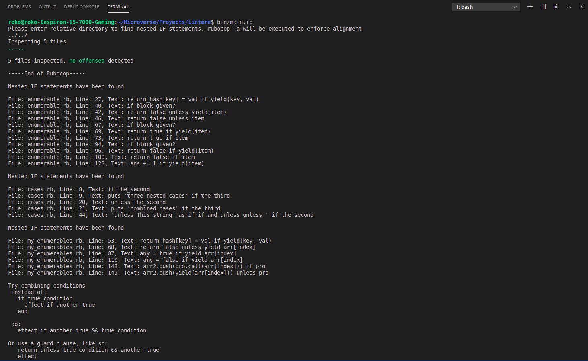

# Ruby DRY Lintern

This program detects and presents nested if and unless statements found in all ruby files in a directory

## Built With

- RUBY

## Running the Program

For this program to be running, [Rubocop](https://docs.rubocop.org/rubocop/installation.html) must be installed first.

To run the program, go first clone [this repo](https://github.com/RokoVarano/Lintern/tree/feature/project)

In the terminal, navigate to the program's directory and type:
  bin/main.rb

You will be asked to enter a relative directory. For Example:
  ../my_other_project/

The program will first run 'rubocop -a' to ensure that your files have correct indentation, which is essential for it to run.
Then it will present you with the lines that contain the nested statements, including file name, line and text.

If the process takes too long (more than a minute) or no ruby files are found in the directory, it will ask again to provide a valid relative directory.

If you need to quit, just type 'QUIT' in all caps to exit the program.

## Authors

👤 **Rodrigo Ibaceta**

- GitHub: [Rodrigo Ibateca](https://github.com/RokoVarano/)
- Twitter: [@Rodrigo](https://twitter.com/RodrigoIbacet11)
- LinkedIn: [LinkedIn](https://www.linkedin.com/in/rodrigo-ibaceta-a8657611a/)

## 🤝 Contributing

Contributions, issues, and feature requests are welcome!

Feel free to check the [issues page](issues/).

## Show your support

Give a ⭐️ if you like this project!

## Acknowledgments

- Hat tip to anyone whose code was used
- Inspiration
- etc

## 📝 License

This project is [MIT](lic.url) licensed.